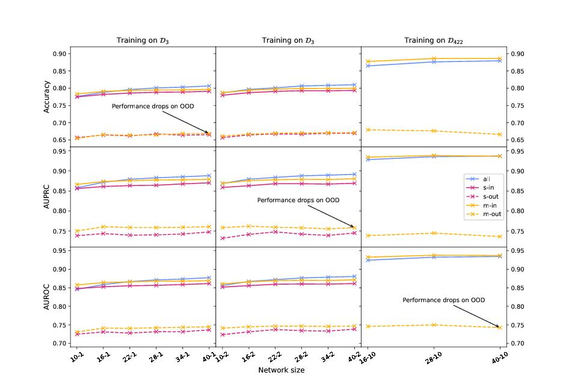

# TF_OOD_Robustness
Towards more robust transcription factor binding site classifiers using out-of-distribution data (ICAART 2025), István Megyeri and Gergely Pap

## Environment setup
```
conda create -n tfood python=3.11.9
conda install pytorch==2.3.0 torchvision==0.18.0 torchaudio==2.3.0 pytorch-cuda=11.8 -c pytorch -c nvidia
conda install pandas==2.2.1
conda install tqdm==4.66.4
pip install tensorboard==2.16.2
conda install scikit-learn==1.4.2
conda install matplotlib==3.8.4
```

## Model training
3 tf models:

``./train3tf.sh``

you might also run tensorboard for the 3 tf models:

``
tensorboard --logdir .\saved_models_wrn_cyclic
``

## Eval models
3 tf models:

``./eval3tf.sh``

## Generate Figure

``python make_fig.py --fnames results_2024-09-04_wrn_cyclic_3tf_test.csv``

Output should look like:
